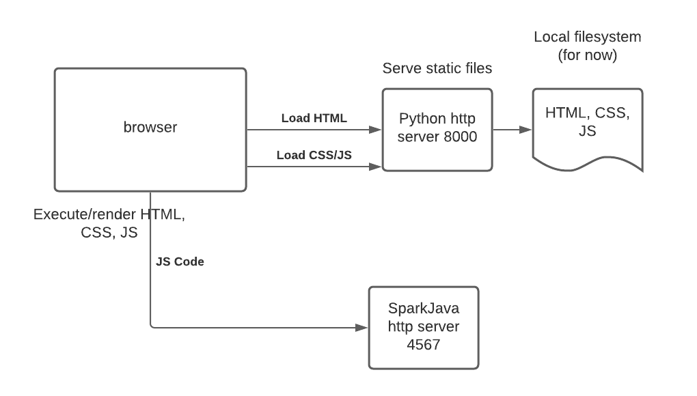

# coopflix-frontend-basic

Basic coopflix frontend using vanilla HTML, CSS, JavaScript.

To run this frontend, you should first run coopflix Spark Java server on localhost:4567.

Then, to set up a very simple static file HTTP server (python2 or python3):

```bash
cd coopflix-frontend-basic/src
python -m http.server  # or python3 -m http.server
python -m SimpleHTTPServer  # python2 -m SimpleHTTPServer
```

Then, go to localhost:8000 in your browser. As you change files, you should be able to refresh the page to see changes.

Basic diagram of how this works together:


